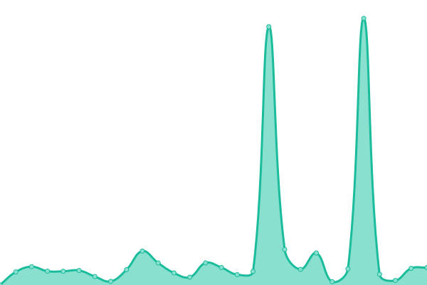

# [📈 Live Status](https://status.worldofsteelcraft.tk): <!--live status--> **🟧 Partial outage**

This repository contains the open-source uptime monitor and status page for [Upptime](https://upptime.js.org), powered by [Upptime](https://github.com/upptime/upptime).

With [Upptime](https://upptime.js.org), you can get your own unlimited and free uptime monitor and status page, powered entirely by a GitHub repository. We use [Issues](https://github.com/upptime/upptime/issues) as incident reports, [Actions](https://github.com/worldofsteelcraft/statuspage/actions) as uptime monitors, and [Pages](https://status.worldofsteelcraft.tk) for the status page.

<!--start: status pages-->
<!-- This summary is generated by Upptime (https://github.com/upptime/upptime) -->
<!-- Do not edit this manually, your changes will be overwritten -->
<!-- prettier-ignore -->
| URL | Status | History | Response Time | Uptime |
| --- | ------ | ------- | ------------- | ------ |
|  [Main Website](https://worldofsteelcraft.tk) | 🟩 Up | [main-website.yml](https://github.com/worldofsteelcraft/status/commits/HEAD/history/main-website.yml) | 

 340ms
     
 | 

<a href="https://status.worldofsteelcraft.tk/history/main-website">100.00%</a>
    

|  SMP Server | 🟥 Down | [smp-server.yml](https://github.com/worldofsteelcraft/status/commits/HEAD/history/smp-server.yml) | 

 1027ms
     
 | 

<a href="https://status.worldofsteelcraft.tk/history/smp-server">99.80%</a>
    

|  [WoSC Files](https://files.worldofsteelcraft.tk) | 🟩 Up | [wo-sc-files.yml](https://github.com/worldofsteelcraft/status/commits/HEAD/history/wo-sc-files.yml) | 

 1040ms
     
 | 

<a href="https://status.worldofsteelcraft.tk/history/wo-sc-files">100.00%</a>
    

|  [Link Service 1](https://wosc.tk) | 🟩 Up | [link-service-1.yml](https://github.com/worldofsteelcraft/status/commits/HEAD/history/link-service-1.yml) | 

 432ms
     
 | 

<a href="https://status.worldofsteelcraft.tk/history/link-service-1">100.00%</a>
    

|  [Link Service 2](https://lnksvc2.wosc.tk) | 🟩 Up | [link-service-2.yml](https://github.com/worldofsteelcraft/status/commits/HEAD/history/link-service-2.yml) | 

 471ms
     
 | 

<a href="https://status.worldofsteelcraft.tk/history/link-service-2">100.00%</a>
    

<!--end: status pages-->

[**Visit our status website →**](https://status.worldofsteelcraft.tk)

## 📄 License

- Powered by: [Upptime](https://github.com/upptime/upptime)
- Code: [MIT](./LICENSE) © [Upptime](https://upptime.js.org)
- Data in the `./history` directory: [Open Database License](https://opendatacommons.org/licenses/odbl/1-0/)
